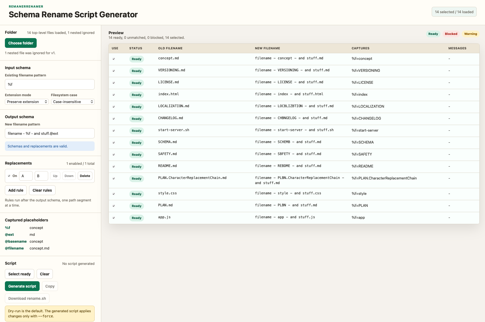

# RemanerRenamer

RemanerRenamer is a static browser app for building safe batch rename plans.
It does not rename files in the browser. It previews filename mappings and
generates a Bash script that dry-runs by default.



## Demo

The public demo is available at https://schrankmonster.de/renamer/.

## Use

Open `index.html` in a modern browser, or serve the folder locally:

```bash
python3 -m http.server 8080
```

Then open `http://localhost:8080`.

The repository also includes a helper script for the same local server:

```bash
./start-server.sh
```

1. Choose a folder.
2. Enter an input schema for current filenames.
3. Review captured placeholders.
4. Enter an output schema for new filenames.
5. Review the preview table and deselect files that should not be included.
6. Generate, copy, or download `rename.sh`.
7. Run the script once without `--force`.
8. Run it again with `--force` only after reviewing the dry run.

The browser remembers the input schema, output schema, and replacement rules on
the same device. Use the syntax guide link in the app for an in-place reference
with examples.

```bash
cd "/path/to/your/folder"
bash rename.sh
bash rename.sh --force
```

## Examples

Placeholders can be written as `%name` or `%{name}`. Use the braced form when
literal text immediately after the placeholder starts with a letter, number, or
underscore.

### Date parts

Filename:

```text
2026-05-01 - Das ist ein - Test.mp4
```

Input schema:

```text
%{a}-%{b}-%{c} - %{title} - %{suffix}
```

Output schema:

```text
%{c}%{b}%{a} - %{title}.@ext
```

Result:

```text
01052026 - Das ist ein.mp4
```

The older unbraced form also works here because every input placeholder is
followed by a clear literal separator:

```text
Input:  %a-%b-%c - %title - %suffix
Output: %c%b%a - %title.@ext
```

### Delimited episode code

Filename:

```text
Mittendrin_-_Flughafen_Frankfurt-100_Jahre_Lufthansa__Propeller,_Piloten_und_Pillbox__(S16_E05)-0168821512.mp4
```

Input schema:

```text
%{title}__(S%{season}_E%{episode})%{id}
```

Output schema:

```text
S%{season}E%{episode}.@ext
```

Result:

```text
S16E05.mp4
```

Without braces, `%title__`, `%season_E`, or `%seasonE` would be read as whole
placeholder names. Braces make the intended split explicit.

### Folder output

Output schemas can also include folders. A `/` separator makes the generated
script place the file in a relative folder path and create folders as needed
when run with `--force`:

```text
%{a}/%{c}%{b}%{a}/%{title}.@ext
```

Result:

```text
2026/01052026/Das ist ein.mp4
```

### Full filename mode

Preserve extension mode matches only the basename. Full filename mode matches
the complete filename, including the extension.

Filename:

```text
Interview.2026.mp4
```

Extension mode:

```text
Full filename
```

Input schema:

```text
%{title}.%{year}.mp4
```

Output schema:

```text
%{year} - %{title}.@ext
```

Result:

```text
2026 - Interview.mp4
```

### Replacement rules

Replacement rules can clean rendered output before validation and script
generation. For example, add rules like:

```text
& -> and
: -> -
```

These rules run after the output schema, from top to bottom, on each folder or
filename segment. The generated script receives the final previewed paths only.

## Development

No build step or package install is required.

Start a local static server with:

```bash
./start-server.sh
```

Run the logic tests with:

```bash
node tests/logic.test.js
```

## Safety

- No file contents or rename data are uploaded to a server, processed remotely,
  or stored on a server. The app handles filenames locally in the browser.
- The browser app never writes to the filesystem.
- The generated script validates sources and targets before applying.
- The generated script creates target folders when output schemas contain `/`.
- Replacement rules are previewed and validated before script generation.
- The generated script does not silently overwrite targets.
- Real renames happen only with `--force`.

See `SCHEMA.md` and `SAFETY.md` for details.
